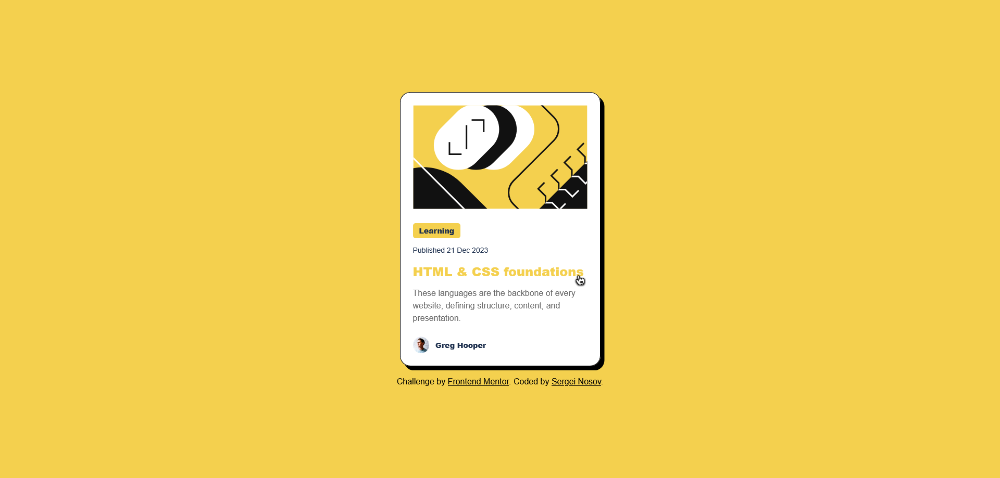

# Frontend Mentor - Blog preview card solution

This is a solution to the [Blog preview card challenge on Frontend Mentor](https://www.frontendmentor.io/challenges/blog-preview-card-ckPaj01IcS). Frontend Mentor challenges help you improve your coding skills by building realistic projects. 

## Table of contents

- [Overview](#overview)
  - [The challenge](#the-challenge)
  - [Screenshot](#screenshot)
  - [Links](#links)
- [My process](#my-process)
  - [Built with](#built-with)
  - [What I learned](#what-i-learned)
  - [Continued development](#continued-development)
  - [Useful resources](#useful-resources)
- [Author](#author)
- [Acknowledgments](#acknowledgments)


## Overview


### Screenshot




### The challenge

Users should be able to:

- See hover and focus states for all interactive elements on the page

### Screenshot


Add a screenshot of your solution. The easiest way to do this is to use Firefox to view your project, right-click the page and select "Take a Screenshot". You can choose either a full-height screenshot or a cropped one based on how long the page is. If it's very long, it might be best to crop it.

Alternatively, you can use a tool like [FireShot](https://getfireshot.com/) to take the screenshot. FireShot has a free option, so you don't need to purchase it. 

Then crop/optimize/edit your image however you like, add it to your project, and update the file path in the image above.

**Note: Delete this note and the paragraphs above when you add your screenshot. If you prefer not to add a screenshot, feel free to remove this entire section.**

### Links

- Solution URL: [Add solution URL here](https://your-solution-url.com)
- Live Site URL: [Add live site URL here](https://your-live-site-url.com)

## My process

### Built with

- Semantic HTML5 markup
- CSS custom properties
- Flexbox
- CSS Grid
- Adaptive typography using clamp()
- CSS pseudo-elements (::after) for hover effects

### What I learned

In this project, I focused on using CSS techniques to make a clean, scalable component.

🟡 CSS Variables

Defined color and typography presets as reusable design tokens:

```
:root {
  --Yellow: #F4D04E;
  --Gray-950: #1f314f;
  --text-preset-1: 800 24px/150% "Figtree", sans-serif;
}
```

🔤 Adaptive Typography

Used clamp() to make font sizes responsive without media queries:
```
.card__title {
  font-size: clamp(20px, 5vw, 24px);
}
```

🖱️ Hover Effects with ::after

Added an icon on hover that scales and repositions adaptively:

```
.card__title:hover::after {
  content: "";
  position: absolute;
  right: -0.5em;
  top: 1.2em;
  width: 1em;
  height: 1em;
  background: url(../assets/images/Pointer.svg) no-repeat center / contain;
}
```

This was my first time using ::after for an interactive visual element — it helped me understand stacking context and relative positioning.

🧠 Flexbox Practice

I used Flexbox to organize the layout of the card’s sections (image, content, author).

## Author

- GitHub - [Sergei Nosov](https://github.com/sereny33/)
- Frontend Mentor - [@sereny33](https://www.frontendmentor.io/profile/sereny33)
- Telegram - [@serenysereny](https://t.me/serenysereny)
